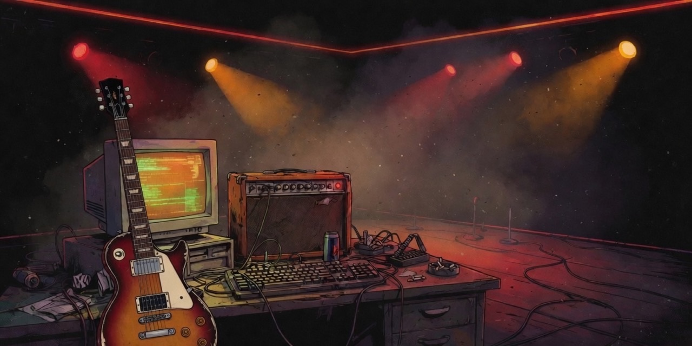

  

  

### D.Yang

**Full-stack engineer** from Chongqing. I ship software and play it loud.

I helped build [MyBatis-Plus](https://github.com/baomidou/mybatis-plus) as an org admin (17k+ stars). These days I write coding agents that live in the terminal. Right now that's [oh-my-dsh](https://github.com/agi-fans/oh-my-dsh).

If the commit graph is quiet, check the amp.

[Blog](https://dyang.top) · [X](https://x.com/yangyang0507)

  

### Tonight's set

1. **[oh-my-dsh](https://github.com/agi-fans/oh-my-dsh)** — keyboard-first DeepSeek coding agent
2. **[starepo](https://github.com/yangyang0507/starepo)** — semantic search over your GitHub stars
3. **[pi-wechat](https://github.com/yangyang0507/pi-wechat)** — WeChat channel for Pi agents

### Back catalog

- **[MyBatis-Plus](https://github.com/baomidou/mybatis-plus)** — org admin. Still touring.

<picture>
  <source media="(prefers-color-scheme: dark)" srcset="profile/stats-dark.svg">
  
</picture>
